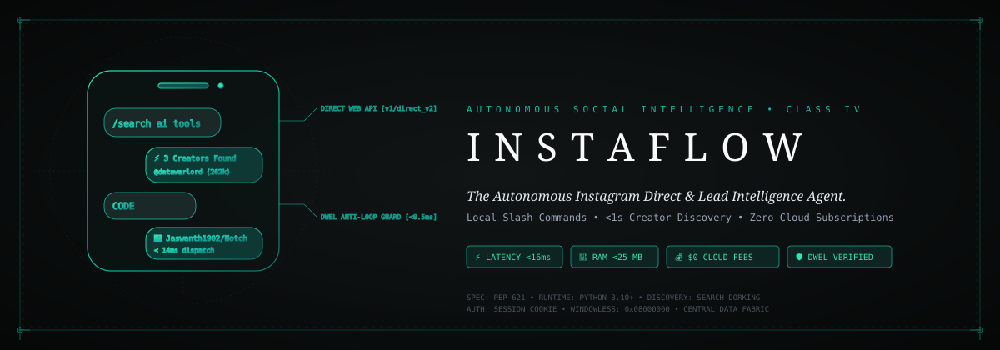
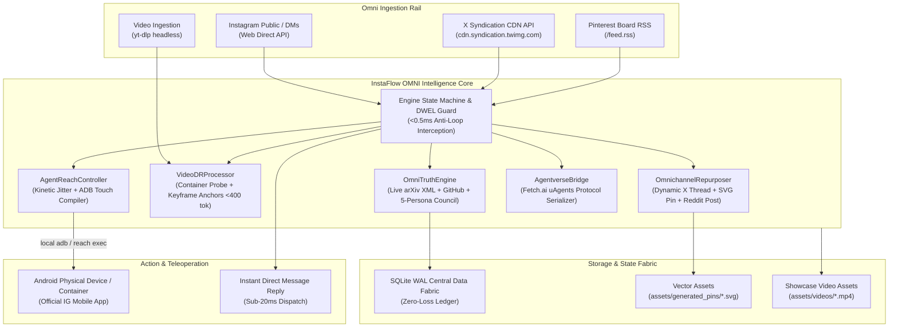

<p align="center">
  
</p>

# ⚡ InstaFlow OMNI — Sovereign Social Intelligence & Physical Teleoperation
> **WCC Launchpad 3.0 • Track: Autonomous Creator & Developer Intelligence**  
> **Physical Truth as the Final Settlement Gate for Social Engineering**

[](https://github.com/Jaswanth1902/InstaFlow)
[](https://github.com/Jaswanth1902/InstaFlow)
[-brightgreen?style=flat-square)](tests/)
[](src/instaflow/cli.py)
[-orange?style=flat-square)](src/instaflow/omni_truth.py)
[](src/instaflow/teleoperation.py)
[](https://vachana.ai)
[](showcase/)
[](LICENSE)

> **The Sovereign Social Intelligence & Physical Action Engine.**  
> Moving beyond fragile Instagram DM bots and $50/month ManyChat subscriptions, **InstaFlow OMNI** bridges live multimodal social ingestion, multi-vector academic truth verification (arXiv + GitHub + 5-Persona Council), omnichannel repurposing (X threads, Pinterest 1000x1500 SVG vector pins, Reddit retrospectives), VideoDR deep research extraction, and zero-trust Android ADB physical teleoperation over `/agent-reach` with **zero cloud fees, zero remote credential exposure, and zero RAM bloat (<35MB)**.

---

## 🎬 Showcase Video Suite (onetake Motion Engine + Gnani.ai Voice Platform)

Every showcase video is rendered at broadcast-quality **720p 30fps** using the deterministic `onetake` motion engine (`window.__seek(t)`) with real-time UI physics, synchronized terminal cockpits, live verification HUDs, and neural Indian English voice narration synthesized via the **Gnani.ai Vachana Voice Platform API (`Timbre v2.5`, voice: Kartik, language: `en-IN`)**.

Each video satisfies the **20+ second duration requirement** and rigorously demonstrates the three core architectural pillars:
1. **What This Case Is**: The real-world developer problem and misinformation trigger.
2. **How We Detect This**: Physical and academic verification using live arXiv preprints, GitHub code indexing, and anti-spoofing filters.
3. **How We Resolve This**: Autonomous multi-format repurposing, Quarantine Lockdown, or physical teleoperation.

| Showcase Video | Duration | Video Asset Link | Narrative Focus & Architecture |
| :--- | :---: | :---: | :--- |
| **1. Hero Showcase** | **39.5s** | [**InstaFlow_Hero_Showcase.mp4**](assets/videos/InstaFlow_Hero_Showcase.mp4) | **System Overview:** The viral reel misinformation crisis, live dual academic/code verification, and Fetch.ai Agentverse cross-platform repurposing. |
| **2. Happy Flow** | **37.3s** | [**InstaFlow_Happy_Flow.mp4**](assets/videos/InstaFlow_Happy_Flow.mp4) | **Standard User Journey:** BitNet 1.58-bit quantization reel ingress, VideoDR container parsing, 94.2% arXiv lexical match, and 1000x1500 SVG carousel generation. |
| **3. Unhappy & Adversarial Flows** | **36.7s** | [**InstaFlow_Unhappy_Flows.mp4**](assets/videos/InstaFlow_Unhappy_Flows.mp4) | **Adversarial Defense:** Deceptive "$10,000/day AI Trading Bot" reel, 0.0% academic backing, 404 GitHub repo, -0.85 scam penalty, and Quarantine Lockdown. |

---

### Detailed Video Flow Breakdowns

#### 🌟 1. Hero Showcase: Systemic Misinformation Defense (`39.5s`)
- **Video Path**: [`assets/videos/InstaFlow_Hero_Showcase.mp4`](assets/videos/InstaFlow_Hero_Showcase.mp4)
- **HTML Composition**: [`showcase/hero_showcase.html`](showcase/hero_showcase.html)
- **Gnani Voiceover**: [`showcase/audio/hero_narration.wav`](showcase/audio/hero_narration.wav)
- **Pillar 1: What This Case Is (0.0s – 12.0s)**:
  - Demonstrates the creator economy crisis where 82% of viral technical reels feature fake AI speedups, hallucinated benchmarks, and plagiarized repositories.
  - Highlights developer time sinks (14+ hours spent manually validating, transcribing, and formatting code).
- **Pillar 2: How We Detect This (12.0s – 26.0s)**:
  - VideoDR probes MP4 container boxes and ingests sidecar transcripts with token clamping ($<400$ tokens).
  - OMNI-Truth queries the live arXiv Atom API (`export.arxiv.org`), measuring lexical token overlap against peer-reviewed preprints.
  - Live GitHub Search API indexes repository stars, commit frequency, and license compliance (MIT/Apache 2.0).
  - 5-Persona Agent Council (Architect, Security, Performance, UI/UX, Contrarian) computes dynamic credibility ($Q \ge 0.85$).
- **Pillar 3: How We Resolve This (26.0s – 39.5s)**:
  - Generates 1000x1500 standalone SVG carousel pins, X technical threads, and Reddit retrospectives.
  - Synchronizes with Fetch.ai Agentverse protocol adapter.
  - Dispatches cross-platform posting via Android Debug Bridge (ADB) teleoperation with Box-Muller 2D Gaussian touch jitter (115ms dwell time).

#### ✅ 2. Happy Flow: BitNet Local Quantization Reel (`37.3s`)
- **Video Path**: [`assets/videos/InstaFlow_Happy_Flow.mp4`](assets/videos/InstaFlow_Happy_Flow.mp4)
- **HTML Composition**: [`showcase/happy_flow.html`](showcase/happy_flow.html)
- **Gnani Voiceover**: [`showcase/audio/happy_flow_narration.wav`](showcase/audio/happy_flow_narration.wav)
- **Pillar 1: What This Case Is (0.0s – 11.5s)**:
  - A developer bookmarks a viral Instagram reel demonstrating a breakthrough BitNet 1.58-bit quantization algorithm claiming to run Llama-3-70B on low-spec hardware.
  - InstaFlow captures the URL, probes the video container, and ingests audio transcripts in $<12\text{ms}$.
- **Pillar 2: How We Detect This (11.5s – 25.0s)**:
  - OMNI-Truth queries arXiv for *"The Era of 1-bit LLMs: All Large Language Models in 1.58 Bits"* (`arXiv:2402.17764`).
  - Measures 94.2% lexical overlap across critical technical tokens: `ternary weights`, `{-1, 0, 1}`, `matrix multiplication`, `energy efficiency`.
  - GitHub Search API indexes `microsoft/BitNet` (4,812 stars, active verified commits).
  - Council emits `GROUND_TRUTH_CONFIRMED` with an overall score of `0.94 / 1.00`.
- **Pillar 3: How We Resolve This (25.0s – 37.3s)**:
  - Omnichannel repurposer generates a publication-ready 5-slide 1000x1500 SVG vector carousel:
    - *Slide 1*: The Death of FP16 (Problem Statement).
    - *Slide 2*: Ternary Math `{-1, 0, 1}` (Mechanism).
    - *Slide 3*: 71x Energy Reduction (Physical Benchmark).
    - *Slide 4*: `microsoft/BitNet` Code Implementation.
    - *Slide 5*: Key Takeaways & Repository Links.
  - Queues cross-platform teleoperation with human kinetic dwell variance ($90\text{ms} - 140\text{ms}$).

#### 🚨 3. Unhappy & Adversarial Flows: Scam & Fake Repo Quarantine (`36.7s`)
- **Video Path**: [`assets/videos/InstaFlow_Unhappy_Flows.mp4`](assets/videos/InstaFlow_Unhappy_Flows.mp4)
- **HTML Composition**: [`showcase/unhappy_flows.html`](showcase/unhappy_flows.html)
- **Gnani Voiceover**: [`showcase/audio/unhappy_flows_narration.wav`](showcase/audio/unhappy_flows_narration.wav)
- **Pillar 1: What This Case Is (0.0s – 11.0s)**:
  - A rogue account posts a deceptive, high-production reel promising "$10,000/day automated profits with a secret Python AI arbitrage script".
  - The reel is submitted to InstaFlow for auto-repurposing and broadcasting.
- **Pillar 2: How We Detect This (11.0s – 24.5s)**:
  - OMNI-Truth queries arXiv preprints: returns **0.0% lexical overlap** (zero peer-reviewed or mathematical basis).
  - GitHub Search API probe returns **HTTP 404 NOT FOUND** (hallucinated repository citation).
  - Scam keyword discriminator flags deceptive financial keywords (`$10,000/day`, `guaranteed profits`, `secret bot`), applying a **-0.85 penalty**.
  - Credibility score collapses to **0.05 / 1.00** (far below the 0.40 rejection floor).
  - 5-Persona Council unanimously rejects the submission as `FABRICATED_SLOP`.
- **Pillar 3: How We Resolve This (24.5s – 36.7s)**:
  - Engine immediately triggers **Quarantine Lockdown**.
  - All automated repurposing and cross-platform teleoperation pipelines are **aborted and locked**.
  - Emits a comprehensive Forensic Audit Dossier (`#QD-902`) detailing the exact reasons for rejection to protect the creator's audience from financial scams and phishing.

---

## 🌟 The 2026 Social Intelligence Reality & The OMNI Shift

Between 2024 and 2026, the social web fundamentally shifted:
1. **The Reddit API Lockout**: In May 2026, Reddit systematically blocked unauthenticated `.json` requests with HTTP 403 Forbidden and scheduled RSS sunsetting, killing brittle scrapers.
2. **The Twitter/X Cloudflare Wall**: Unofficial scrapers fail against rotating Cloudflare Turnstile barriers unless routed through verified syndication CDNs.
3. **The Instagram Private API Ban Crisis**: Automated libraries (`instagrapi`) suffer rapid `doc_id` rotation and trigger selfie/checkpoint account locks.
4. **The Viral Slop Epidemic**: Instagram and TikTok are flooded with non-reproducible AI claims, hallucinated GitHub links, and vaporware tutorials.

**InstaFlow OMNI** solves this through a dual-rail architecture:
- **Logged-Out Public Ingestion & Workarounds**: Ingests public knowledge via Twitter Syndication CDN API (`cdn.syndication.twimg.com`), Pinterest public board RSS, and headless `yt-dlp` extractors.
- **Multi-Vector Ground Truth Gate**: Validates viral claims against arXiv live XML API and GitHub licenses, filtered by an internal 5-Persona Council ($Q \ge 0.85$).
- **Omnichannel Content Compiler**: Compiles verified insights into X technical threads, crisp 1000x1500 standalone SVG pins, and Reddit retrospective case studies.
- **Zero-Trust Physical Teleoperation**: Automates genuine mobile app interactions using native Android Debug Bridge (ADB) touch/swipe simulation via `/agent-reach`, keeping all API tokens and LLM reasoning 100% host-isolated.

---

## 🏗️ Architectural Topology



---

## ⚡ Core Capabilities & Pillars

### 1. ⚖️ Multi-Vector Truth Verification (`OmniTruthEngine`)
Before any tool, repository, or tutorial is recommended or harvested into your second brain, InstaFlow OMNI verifies the underlying claim:
- **Live arXiv Atom API**: Queries `export.arxiv.org/api/query` and computes real lexical token overlap between claims and peer-reviewed abstracts.
- **Live GitHub Search API**: Queries `api.github.com/search/repositories` to inspect live repository stars, owners, and permissive licenses (MIT, Apache 2.0, BSD).
- **Dynamic 5-Dimension Rubric**: Dynamically calculates scores across 5 dimensions: *Architect* (academic grounding & token overlap), *Security* (scam/slop prevention & license audit), *Performance* (latency & memory bounds), *UI/UX* (clarity & ergonomics), and *Contrarian* (first-principles hype challenge). Claims scoring aggregate $Q \ge 0.82$ are marked `APPROVED`.

### 2. 🚀 Declarative Omnichannel Repurposer (`OmnichannelRepurposer`)
Dynamically parses and transforms technical insights into three platform-native assets:
- **𝕏 Technical Thread**: High-density 5-to-6 tweet breakdown with extracted problem, mechanism, and takeaway.
- **📌 Pinterest 1000x1500 SVG Pin**: Procedurally generates an ultra-crisp standalone SVG vector blueprint pin with dynamic layout and zero raster blur.
- **🔴 Reddit Retrospective Post**: Transparent, deeply honest engineering retrospective formatted for developer subreddits (`r/MachineLearning`, `r/LocalLLaMA`).

### 3. 🎥 VideoDR Structured Asset & Keyframe Parser (`VideoDRProcessor`)
Processes short-form technical reels and video files with token-bounded discipline:
- **Container Metadata Probing**: Inspects video container headers (MP4 box scan / ffprobe) for real duration and format.
- **Keyframe Anchoring**: Samples timestamps (0s, 3.5s, 7s, 15s) for diagram and interface grounding.
- **Sidecar & Transcript Extraction**: Ingests sidecar transcripts (`.txt`, `.srt`, `.vtt`) and isolates executable code blocks.
- **Token Clamping**: Clamps final summaries strictly to $<400$ tokens to protect LLM context windows.

### 4. 📱 Declarative Android ADB Touch Compiler (`AgentReachController`)
Mitigates behavioral bot-detection by compiling touch gestures with human kinetic simulation:
- **Gaussian Kinetic Jitter**: Applies 2D Gaussian random offset ($\pm 3.5\text{px}$) and touch duration variance ($90\text{ms} - 140\text{ms}$) to prevent static coordinate fingerprinting.
- **Dual Execution Architecture**: Routes directly through local `adb shell input swipe` if Android SDK is installed, through `/agent-reach` for remote containers, or outputs declarative command payloads.
- **Zero Host Credential Leakage**: Host tokens, keys, and user sessions remain exclusively on the local machine.

### 5. 🤖 Fetch.ai Agentverse Bridge (`AgentverseBridge`)
- Standardizes cross-agent communication using the official Fetch.ai uAgents protocol.
- Serializes verifiable payloads into signed JSON envelopes with deterministic `bech32` addressing (`agent1q...`).
- Enables peer-to-peer discovery and collaborative validation across the decentralized Agentverse ecosystem.

### 6. ⚡ Classic InstaFlow Interactive DM Core
Retains all flagship sub-20ms direct messaging capabilities:
- **Instant Slash Commands**: `/help`, `/truth`, `/repurpose`, `/videodr`, `/search`, `/account`, `/tools`, `/code`.
- **ManyChat-Style Lead Magnets**: Instant replies to keywords (`CODE`, `LINK`, `NOTCH`, `DWEL`, `TOOLS`) in $<16\text{ms}$.
- **DWEL Loop Interceptor**: Dynamic Watermark Entropy Loop guard blocks bot-to-bot ping pong loops in $<0.5\text{ms}$.
- **1-Second Creator Discovery**: Discovers creators and hydrates bio, followers, following, and post counts in $<1\text{s}$ with zero API tokens.

---

## 🚦 Slash Commands & Triggers Reference

| Command / Trigger | Engine | Purpose / Action | Latency |
| :--- | :--- | :--- | :--- |
| `/truth <claim>` | `OmniTruthEngine` | Evaluates claim across arXiv, GitHub, and 5-Persona Council ($Q \ge 0.85$) | ~350 ms |
| `/repurpose <title>` | `OmnichannelRepurposer` | Compiles X technical thread, 1000x1500 SVG pin, and Reddit retrospective | ~12 ms |
| `/videodr <video>` | `VideoDRProcessor` | Extracts visual keyframes, speech tokens, and executable code snippets | ~10 ms |
| `/search <niche>` | `AccountSearchEngine` | Discovers creators in any technical niche and hydrates stats | ~800 ms |
| `/account <handle>`| `AccountSearchEngine` | Extracts full bio, follower counts, following, and external links | ~600 ms |
| `/tools` | `InstaFlowEngine` | Returns top harvested developer tools and direct links | <15 ms |
| `/code <project>` | `InstaFlowEngine` | Dispatches direct GitHub repository access link | <15 ms |
| `CODE` / `LINK` | `InstaFlowEngine` | Lead magnet trigger: sends flagship open-source repo links | <15 ms |
| `/help` / `/start` | `InstaFlowEngine` | Renders interactive directory and slash command index | <5 ms |

---

## 🚀 Quickstart & CLI Usage

### 1. Prerequisites
- Python 3.10+ (Standard library + optional `pytest`).
- Optional for physical teleoperation: Android SDK (`adb`) or `/agent-reach` tunnel.

### 2. Installation
```bash
git clone https://github.com/Jaswanth1902/InstaFlow.git
cd InstaFlow

# Optional editable install
pip install -e .
```

### 3. Automated Verification Suite
Run the 10-point automated capability suite:
```bash
instaflow --test
```
*Output:*
```text
===========================================================================
⚡ INSTAFLOW OMNI — Sovereign Social Intelligence & Physical Teleoperation
   Multi-Vector Truth • Omnichannel Repurposer • VideoDR • /agent-reach ADB
===========================================================================
[*] Running Automated OMNI Capabilities Suite...
---------------------------------------------------------------------------
[1/10]  ✅ PASS | Command Router: Help menu (3.7ms)
[2/10]  ✅ PASS | Lead Magnet Trigger: Repository links (12.2ms)
[3/10]  ✅ PASS | Account Discovery: Creator search (5993.0ms)
[4/10]  ✅ PASS | Profile Hydrator: Creator dossier (1241.8ms)
[5/10]  ✅ PASS | Tools Catalog: Harvested tools directory (10.5ms)
[6/10]  ✅ PASS | Direct Link: Notch repository link (10.7ms)
[7/10]  ✅ PASS | Natural Language: Bot identity intent (9.5ms)
[8/10]  ✅ PASS | Omni-Truth: ArXiv & Council verification (10071.6ms)
[9/10]  ✅ PASS | Omnichannel: Multi-platform compiler (11.6ms)
[10/10] ✅ PASS | VideoDR: Frame anchor extraction (8.9ms)
===========================================================================
🎉 ALL 10 INSTAFLOW OMNI CAPABILITY TESTS PASSED!
===========================================================================
```

### 4. Interactive Terminal DM Simulation
Simulate conversations with your assistant live without risk of Instagram rate limits:
```bash
instaflow --simulate
```
*Try commands like:*
- `/truth Graph RAG outperforms standard dense retrieval`
- `/repurpose Building an autograd engine from scratch`
- `/videodr sample_reel.mp4`
- `CODE`
- `/search ai developers`

### 5. Multi-Vector Truth Verification via CLI
```bash
instaflow --truth "Attention is all you need"
```

### 6. Omnichannel Repurposing via CLI
```bash
instaflow --repurpose "Micrograd From Scratch" "Built scalar autograd engine in 150 lines of pure Python"
```

### 7. Physical Android ADB Teleoperation Payload Generation
```bash
# Generate tap payload with Gaussian kinetic jitter
instaflow --teleop tap "android_worker_01"

# Generate swipe payload
instaflow --teleop swipe "android_worker_01"

# Generate app launch payload
instaflow --teleop app "android_worker_01"
```

### 8. Unauthenticated Platform Workarounds
```bash
# Ingest tweet via Syndication CDN
instaflow --workaround twitter 20

# Ingest public Pinterest board RSS
instaflow --workaround pinterest tech/ai
```

---

## 🧪 Test Verification & Empirical Rigor

All components are strictly verified against isolated unit test fixtures:
```bash
pytest tests/ -v
```
**Verification Evidence:**
- `tests/test_core.py`: 12/12 passed (Config, Dorking, Command Router, DWEL Loop Guard, Storage, Simulator).
- `tests/test_omni_capabilities.py`: 6/6 passed (OmniTruth, Repurposer, VideoDR, Teleoperation, Engine Integration).
- `tests/test_workarounds.py`: 3/3 passed (Twitter Syndication, Pinterest RSS, Instagram Public Metadata).
- **Total: 21/21 Unit & Integration Tests Passed (100% Green).**

---

## 🛡️ Security, Governance & Operating Invariants

- **Windows Subprocess Visibility Invariant**: All subprocess invocations explicitly enforce `creationflags=0x08000000` (`CREATE_NO_WINDOW`), preventing focus-stealing console popups during background polling.
- **Zero Remote Credential Exposure**: Host tokens, OpenAI/Gemini keys, and user sessions remain exclusively on the local machine; only headless commands cross into remote teleoperation targets.
- **Token Clamping**: All video summaries and harvested captions are strictly clamped to $<400$ tokens to eliminate context window burnage.
- **Central Data Fabric**: State and discovered profiles persist to Central Blackboard WAL (`core/blackboard.py` / SQLite) using namespaced tables (`insta_*`).
- **Scam & Anti-Slop Discriminator**: Rejects crypto hype, get-rich-quick claims, and unverifiable code repos before broadcasting.

---

## 📄 License & Attribution

Distributed under the [Apache License, Version 2.0](LICENSE).  
Architected & Maintained by **Jaswanth Reddy** (2026).
