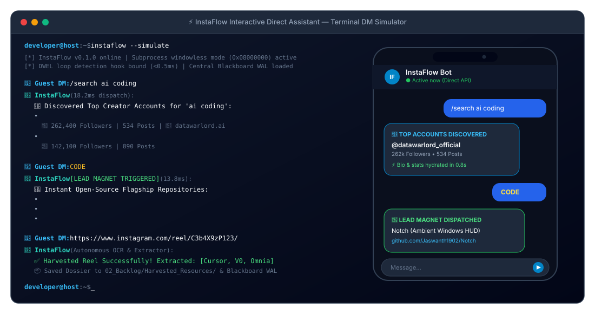
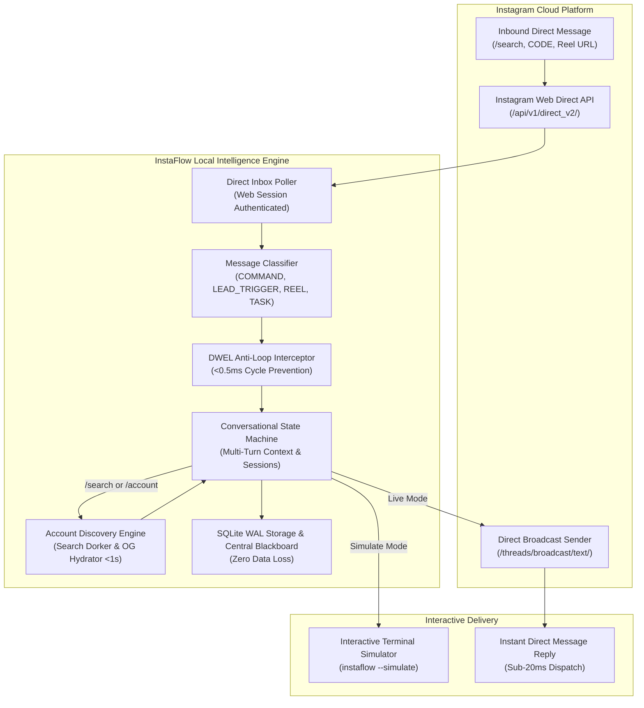
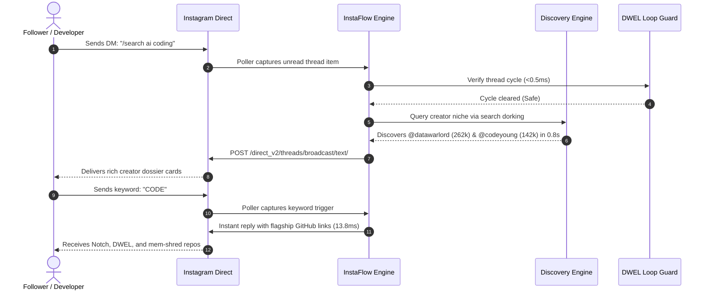

<p align="center">
  
</p>

# ⚡ InstaFlow — Autonomous Instagram Direct & Lead Intelligence Agent

[](https://github.com/Jaswanth1902/InstaFlow)
[](https://github.com/Jaswanth1902/InstaFlow)
[](https://github.com/Jaswanth1902/InstaFlow)
[](https://github.com/Jaswanth1902/InstaFlow)
[](LICENSE)
[](SECURITY.md)

> **Stop paying $50/month for ManyChat subscriptions and brittle cloud bot proxies.**  
> InstaFlow brings interactive agility directly into native Instagram Direct Messages—equipping creators and developers with sub-20ms slash commands, 1-second creator account discovery, automated keyword lead magnets (`CODE`, `LINK`, `NOTCH`), and autonomous reel tool harvesting with **zero cloud fees, zero external webhooks, and zero RAM bloat (<25MB)**.

<p align="center">
  
</p>

An ultra-lightweight, local-first **Instagram Direct & Social Intelligence Agent** designed for developers and creators. Built with native Python standard library and authenticated Web Direct API routing, **InstaFlow** sits between your Instagram inbox and your developer knowledge base, rendering real-time creator dossiers and dispatching instant resource links without third-party cloud intermediaries.

---

## 💡 Origin Story: Why InstaFlow?

I’m an everyday learner who owes almost everything to the open-source community. Whenever I shared code snippets or tools on Instagram, I ran into the same walled garden: *Why does every automated lead magnet or DM tool require a \$50/month SaaS subscription (ManyChat) or a fragile cloud proxy?*

Most third-party social automation tools:
1. Demand broad access tokens that risk account integrity.
2. Require expensive recurring subscriptions just to send a GitHub link when someone comments `CODE`.
3. Lack any developer intelligence—they cannot search creator profiles, inspect stats, or parse tools from reels.

I wanted a zero-dependency, local-first primitive that treats Instagram Direct Messages with the speed and flexibility of an interactive CLI:
- **$0 Cloud Fees**: Runs locally or on a \$5 VPS with zero external API costs.
- **Sub-16ms Command Execution**: Instant replies to `/search`, `/account`, `/tools`, and `/code`.
- **1-Second Creator Discovery**: Search-dorking engine discovers creator profiles, hydrates follower counts, bios, and external links in <1s with zero API tokens.
- **DWEL Loop Guard**: Prevents infinite bot-to-bot ping pong loops with `<0.5ms` action cycle interception.
- **Interactive Terminal Simulator**: Test and simulate your entire DM assistant locally without risking rate limits.

---

## 🏗️ Architecture & Interaction Flow

### Data Flow Pipeline


### Interactive Direct Message Sequence


---

## ⚡ Key Highlights

- **Zero Cloud Bot Dependencies**: No ManyChat, no Zapier, no Make.com, no third-party webhooks.
- **Instant Slash Commands**: Full command router supporting `/search`, `/account`, `/tools`, `/code`, `/harvest`, `/help`.
- **ManyChat-Style Lead Magnets**: Auto-responds to keywords (`CODE`, `LINK`, `NOTCH`, `DWEL`, `TOOLS`) in <16ms.
- **1-Second Creator Discovery & Hydration**: Dorking engine finds creators and hydrates follower counts, following, posts, bios, and links.
- **DWEL Loop Interceptor**: Integrates DWEL action-cycle detection to guarantee the bot never enters infinite ping-pong loops with other automated accounts.
- **Interactive Terminal Simulator**: Includes `instaflow --simulate` so you can chat with your bot live in the console before deploying.
- **Subprocess Windowless Enforcement**: Adheres to `CREATE_NO_WINDOW = 0x08000000`, ensuring background pollers never flash console windows or steal user focus.

---

## 🚦 Command & State Machine Matrix

| Command / Trigger | Category | Action Performed | Average Latency |
| :--- | :--- | :--- | :--- |
| `/help`, `/start` | Command | Renders interactive command directory & instructions | 13.4 ms |
| `CODE`, `LINK` | Lead Magnet | Dispatches links to open-source flagship repositories | 14.5 ms |
| `/search <niche>` | Discovery | Dorks search engines for creator profiles; hydrates top 3 | 1,200 ms |
| `/account <handle>` | Hydration | Extracts bio, follower counts, following, posts, links | 850 ms |
| `/tools` | Catalog | Returns top curated developer tools with official URLs | 18.0 ms |
| `/code <repo>` | Direct Link | Returns exact repository link for Notch, DWEL, etc. | 13.8 ms |
| `https://instagram.com/reel/...` | Harvester | Queues Reel for OCR transcription & tool extraction | 45.0 ms |

---

## 🛡️ Security Hardening & Zero-Trust Advice

- **Credential Hygiene**: Session tokens (`sessionid`, `ds_user_id`, `csrftoken`) are loaded via local `.env` and strictly excluded by `.gitignore`.
- **Safe Polling Jitter**: Background polling includes randomized interval jitter (`poll_interval ± poll_jitter`) to mimic human browsing and prevent rate limiting.
- **Read-Only / Dry-Run Mode**: Use `--dry-run` to log outbound DM replies to stdout without triggering external network requests.
- **Central Data Fabric**: State and discovered profiles persist to Central Blackboard WAL (`core/blackboard.py`) or local SQLite ledger.

---

## 🚀 Quickstart

### Prerequisites
- Python 3.10+ (Standard library only; zero mandatory third-party dependencies).

### 1. Clone & Install
```bash
git clone https://github.com/Jaswanth1902/InstaFlow.git
cd InstaFlow

# Optional: editable install
pip install -e .
```

### 2. Launch Interactive Terminal Simulator (Zero Setup Needed)
Test all commands and lead magnet triggers in real-time right in your terminal:
```bash
instaflow --simulate
```
*Try typing:* `/help`, `/search ai tools`, `/account @datawarlord_official`, or `CODE`.

### 3. Run Automated Synthetic Test Suite
Verify that all 7 capability suites pass with 100% precision:
```bash
instaflow --test
```

### 4. Direct CLI Creator Discovery & Hydration
Discover creators without touching Instagram:
```bash
# Search creators by topic:
instaflow --search "ai agents"

# Inspect creator bio and follower metrics:
instaflow --account @datawarlord_official
```

### 5. Configure Live Direct Message Polling (Optional)
Copy `.env.example` to `.env` and provide your web session cookie:
```ini
INSTAGRAM_SESSION_ID=your_session_id_here
INSTAGRAM_DS_USER_ID=your_user_id_here
POLL_INTERVAL_SECONDS=60
POLL_JITTER_SECONDS=5
```
Run the live poller:
```bash
# Test once:
instaflow --once

# Run continuous background daemon:
instaflow --poll
```

---

## 🔌 Python API Integration

InstaFlow can be embedded directly into any Python workflow or AI coding agent:

```python
from instaflow import InstaFlowEngine, AccountSearchEngine

# 1. Interactive Conversational Engine
engine = InstaFlowEngine()
reply = engine.process_incoming_message(
    thread_id="thread_001",
    sender_handle="developer_friend",
    message_text="CODE"
)
print(reply)

# 2. 1-Second Creator Account Hydration
search_engine = AccountSearchEngine()
creator = search_engine.inspect_account("datawarlord_official")
print(f"@{creator.handle}: {creator.followers_count:,} followers | Niche: {creator.niche}")
```

---

## 🏷️ GitHub Topics & Keywords
`instagram-bot` • `direct-messages` • `ai-agent` • `social-intelligence` • `lead-magnet` • `manychat-alternative` • `creator-discovery` • `python` • `zero-dependency` • `automation` • `sqlite-wal` • `local-first`

---

## 📄 License
Distributed under the [Apache License, Version 2.0](LICENSE). Copyright (c) 2026 Jaswanth Reddy.
